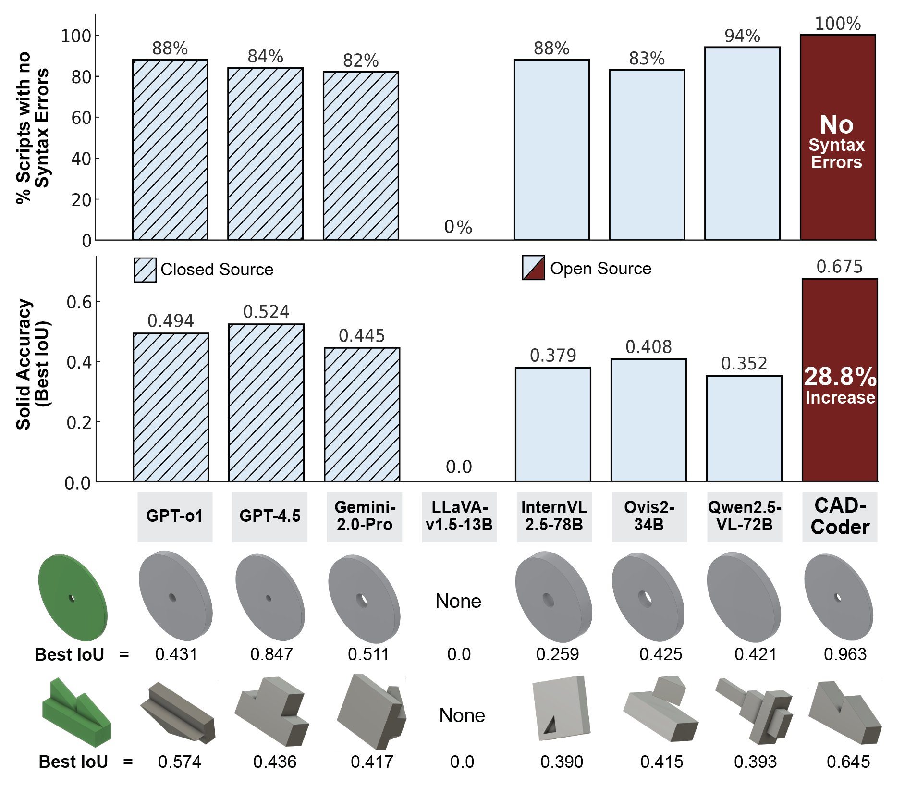

# CAD-Coder

[Paper](https://arxiv.org/abs/2505.14646) | [Dataset](https://github.com/anniedoris/GenCAD-Code) | Project Page (Coming soon!)

## Release Todo List

- [x] Release GenCADCode Dataset
- [ ] Release CAD-Coder and variants on HF
- [ ] Release Training Code

## Overview
**CAD-Coder generates CAD code (CadQuery Python) given an image input! Our model is a fine-tuned, open-source vision-langauge foundation model.** 

On a test-set of CAD images, we demonstrate that CAD-Coder out-performs state-of-the-art closed-source and open-source code-generating VLMs both in terms of valid syntax rate of output Python scripts and generated solid accuracy.

## Dataset
To download our GenCAD-Code dataset, consisting of 163k image-CadQuery Python script pairs, follow the instructions on our corresponding [GenCAD-Code dataset repo](https://github.com/anniedoris/GenCAD-Code).

## Paper
Our paper was accepted to IDETC 2025! Check out our pre-print [here](https://arxiv.org/abs/2505.14646).

## Training Code
Coming soon!